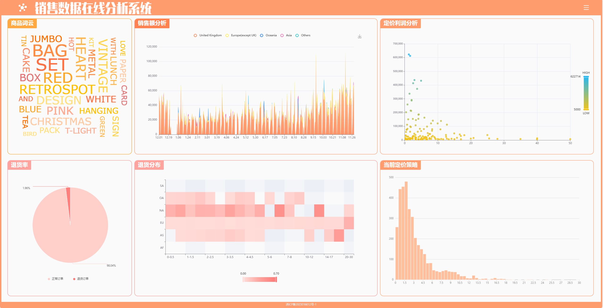

# 销售数据在线分析系统

—— 数据可视化项目

## 项目介绍

使用数据可视化的方法，实现一个针对线上小商品零售业务的可视分析系统。

原始数据来源于 Kaggle 平台公开数据集：[\[online-retails-sale\]](https://www.kaggle.com/datasets/rohitmahulkar/online-retails-sale-dataset)

可参照以下工程说明运行本仓库代码，运行效果可以看 [\[展示页面\]](http://salevis.yujiezju.run)

## 工程说明

### 环境准备

- node.js
- npm
- yarn

**注意**：由于本工程同时使用 yarn 和 npm 进行包管理，建议在安装了 yarn 的情况下，使用 yarn 运行工程，否则可能出现未知报错。

### 快速启动

> 仅列举 yarn 的操作命令，若使用 npm 请参考后续部分文档内容（Getting Started with Create React App）。

进入工程根目录 SaleVis，在终端运行以下命令。

#### 1 安装依赖项
`yarn install`

根据 package.json 自动安装依赖，包括 React 官方库，以及第三方组件库 antd, 图表库 Echarts, ANTV-G2Plot，完成后 node_modules 目录占用约 1.1GB 空间。

#### 2 启动运行工程
`yarn start`

执行命令后等待启动成功，即可在浏览器打开 [http://localhost:3000](http://localhost:3000) 查看运行的页面，首次启动可能需要等待几分钟。

#### 3 打包构建
`yarn build`

工程打包构建后会在项目根目录下生成 build 目录，打开其中的 index.html 可以直接在本地打开页面。

### 工程目录介绍

- public 为网站基本信息，包含标签页标题及 logo 等；
- src 包含整个网页的源代码，其中 index 和 App 为页面加载入口，components 目录包含所有组件
- src/components 目录下，直接包含的 js 文件是构成页面框架的各部分组件，各子目录内为可视化图表，其中 json 文件为数据源

***
以下为 Create React App 框架自带的 README 内容：

## Getting Started with Create React App

This project was bootstrapped with [Create React App](https://github.com/facebook/create-react-app).

## Available Scripts

In the project directory, you can run:

### `npm start`

Runs the app in the development mode.\
Open [http://localhost:3000](http://localhost:3000) to view it in your browser.

The page will reload when you make changes.\
You may also see any lint errors in the console.

### `npm test`

Launches the test runner in the interactive watch mode.\
See the section about [running tests](https://facebook.github.io/create-react-app/docs/running-tests) for more information.

### `npm run build`

Builds the app for production to the `build` folder.\
It correctly bundles React in production mode and optimizes the build for the best performance.

The build is minified and the filenames include the hashes.\
Your app is ready to be deployed!

See the section about [deployment](https://facebook.github.io/create-react-app/docs/deployment) for more information.

### `npm run eject`

**Note: this is a one-way operation. Once you `eject`, you can't go back!**

If you aren't satisfied with the build tool and configuration choices, you can `eject` at any time. This command will remove the single build dependency from your project.

Instead, it will copy all the configuration files and the transitive dependencies (webpack, Babel, ESLint, etc) right into your project so you have full control over them. All of the commands except `eject` will still work, but they will point to the copied scripts so you can tweak them. At this point you're on your own.

You don't have to ever use `eject`. The curated feature set is suitable for small and middle deployments, and you shouldn't feel obligated to use this feature. However we understand that this tool wouldn't be useful if you couldn't customize it when you are ready for it.

## Learn More

You can learn more in the [Create React App documentation](https://facebook.github.io/create-react-app/docs/getting-started).

To learn React, check out the [React documentation](https://reactjs.org/).

### Code Splitting

This section has moved here: [https://facebook.github.io/create-react-app/docs/code-splitting](https://facebook.github.io/create-react-app/docs/code-splitting)

### Analyzing the Bundle Size

This section has moved here: [https://facebook.github.io/create-react-app/docs/analyzing-the-bundle-size](https://facebook.github.io/create-react-app/docs/analyzing-the-bundle-size)

### Making a Progressive Web App

This section has moved here: [https://facebook.github.io/create-react-app/docs/making-a-progressive-web-app](https://facebook.github.io/create-react-app/docs/making-a-progressive-web-app)

### Advanced Configuration

This section has moved here: [https://facebook.github.io/create-react-app/docs/advanced-configuration](https://facebook.github.io/create-react-app/docs/advanced-configuration)

### Deployment

This section has moved here: [https://facebook.github.io/create-react-app/docs/deployment](https://facebook.github.io/create-react-app/docs/deployment)

### `npm run build` fails to minify

This section has moved here: [https://facebook.github.io/create-react-app/docs/troubleshooting#npm-run-build-fails-to-minify](https://facebook.github.io/create-react-app/docs/troubleshooting#npm-run-build-fails-to-minify)
